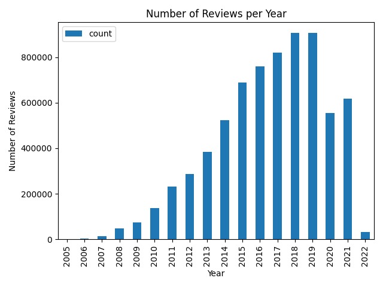
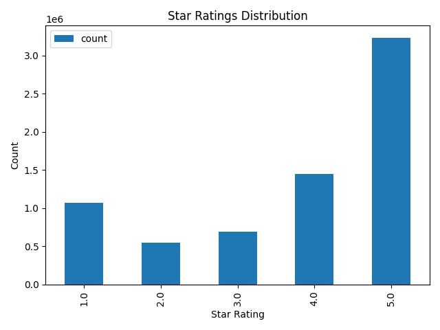

# Yelp Dataset Analytics — Hadoop + Spark Pipeline

End-to-end big-data pipeline that ingests the Yelp Open Dataset into HDFS, cleans it with PySpark, and drives three ML workloads: star-rating prediction, user segmentation, and business-performance forecasting. The entire infrastructure runs locally via Docker Compose (Hadoop 3.4.1 + Bitnami Spark).

---

## Tech Stack

| Layer | Technology |
|---|---|
| Cluster orchestration | Docker Compose |
| Distributed storage | HDFS (Hadoop 3.4.1) |
| Processing engine | Apache Spark (PySpark) |
| ML framework | PySpark MLlib `Pipeline` API |
| Language | Python 3, Java (HDFS ingest) |
| Notebook | Jupyter |

---

## Architecture

```
Raw JSON files (local disk)
        │
        ▼
 HDFS /input/          ← loaded via HDFSIngestion.java or hdfs dfs -put
        │
        ▼
 01_data_cleaning.py   ← PySpark: drop nulls, cap outliers, cast types
        │
        ▼
 HDFS /user/root/output/cleaned/yelp_reviews_cleaned.parquet
        │
   ┌────┴──────────────────────────┐
   ▼                               ▼                               ▼
03_rating_prediction.py   04_user_segmentation.py   05_performance_forecasting.py
(TF-IDF + RF Classifier)  (KMeans Clustering)       (RF Regressor + lag features)
   │                               │                               │
   ▼                               ▼                               ▼
HDFS /user/root/output/rating_predictions
                        /user_segments
                        /forecasting_predictions[_tuned]
```

---

## Dataset

This project uses the [Yelp Open Dataset](https://www.yelp.com/dataset) (academic license).

Five JSON files (~8 GB total) are **not included** in this repository — download them from Yelp and place them in the project root:

```
yelp_academic_dataset_business.json
yelp_academic_dataset_checkin.json
yelp_academic_dataset_review.json
yelp_academic_dataset_tip.json
yelp_academic_dataset_user.json
```

---

## Setup & Reproduction

### Prerequisites
- [Docker Desktop](https://docs.docker.com/get-started/get-docker/) (with Compose v2)
- The five Yelp JSON files in the project root
- Python 3.8+ (for local notebook only)

### 1. Start the cluster

```bash
docker compose -f docker-compose.yaml up -d
```

Web UIs once running:
- HDFS NameNode: http://localhost:9870
- YARN ResourceManager: http://localhost:8088
- Spark Master: http://localhost:8080

### 2. Ingest data into HDFS

```bash
docker exec -it project-namenode-1 bash

# Inside the namenode:
hdfs dfs -mkdir -p /input
hdfs dfs -put /data/yelp_academic_dataset_review.json /input/
# Repeat for other files as needed
```

Or use the provided Java ingestion utility:

```bash
# Compile and run inside the namenode
javac src/HDFSIngestion.java
java HDFSIngestion
```

### 3. Install Python dependencies (inside spark-master)

```bash
docker exec -it project-spark-master-1 bash
pip install -r /opt/bitnami/spark/requirements.txt
```

### 4. Copy scripts into the spark-master container

```bash
docker cp src/. project-spark-master-1:/opt/bitnami/spark/
```

### 5. Run the pipeline in order

```bash
docker exec -it project-spark-master-1 bash

spark-submit --master spark://spark-master:7077 /opt/bitnami/spark/01_data_cleaning.py
spark-submit --master spark://spark-master:7077 /opt/bitnami/spark/02_eda.py
spark-submit --master spark://spark-master:7077 /opt/bitnami/spark/03_rating_prediction.py
spark-submit --master spark://spark-master:7077 /opt/bitnami/spark/04_user_segmentation.py
spark-submit --master spark://spark-master:7077 /opt/bitnami/spark/05_performance_forecasting.py
# Optional: hyperparameter-tuned variant
spark-submit --master spark://spark-master:7077 /opt/bitnami/spark/05b_performance_forecasting_tuned.py
```

### 6. View results

```bash
spark-submit --master spark://spark-master:7077 /opt/bitnami/spark/view_ratings.py
spark-submit --master spark://spark-master:7077 /opt/bitnami/spark/view_segments.py
spark-submit --master spark://spark-master:7077 /opt/bitnami/spark/view_performance.py
```

---

## Pipeline Walkthrough

### `src/01_data_cleaning.py`
Reads the raw review JSON from HDFS, drops rows missing `text` or `stars`, fills missing engagement columns (`useful`, `funny`, `cool`) with zero, adds a `review_length` feature, caps its value at the 99th percentile to suppress outliers, casts numeric columns to integer, and writes the result as a Parquet file back to HDFS. All downstream ML scripts consume this Parquet.

### `src/02_eda.py`
Generates descriptive statistics (review counts, star distributions, yearly trends) and saves summary plots to the local `results/plots/` directory.

### `src/03_rating_prediction.py`
Builds a PySpark `Pipeline` that tokenises review text with `RegexTokenizer`, removes stop words, encodes vocabulary with `CountVectorizer` (vocab size 1 000), applies TF-IDF weighting, and classifies star ratings with a `RandomForestClassifier`. Runs on a 5 % random sample of the cleaned dataset. Uses `TrainValidationSplit` for hyperparameter tuning. Saves the fitted pipeline model and predictions to HDFS.

### `src/04_user_segmentation.py`
Aggregates user behaviour from the cleaned reviews (review count, mean star given, mean review length), assembles these into a feature vector, and applies `KMeans` clustering to segment users into behavioural groups. Evaluates cohesion with Silhouette score. Saves the model and segment assignments to HDFS.

### `src/05_performance_forecasting.py`
Groups reviews by `(business_id, year, month)` to compute monthly average rating and review volume. Constructs lag features (prior-month rating and count) using Spark window functions, then trains a `RandomForestRegressor` to forecast the next month's average rating. Fixed hyperparameters.

### `src/05b_performance_forecasting_tuned.py`
Identical pipeline to `05`, but wraps the regressor in `TrainValidationSplit` with a grid over `numTrees` ∈ {50, 100} and `maxDepth` ∈ {5, 10}. Saves the best model and predictions separately.

---

## Results

### Dataset at a Glance

| Metric | Value |
|---|---|
| Total reviews | 6,990,280 |
| Mean star rating | 3.748 (σ = 1.479) |
| Max "useful" votes on a single review | 1,182 |
| Date range | 2005 – 2022 |

**Summary statistics (numeric columns):**

| Column | Mean | Std Dev | Min | Max |
|---|---|---|---|---|
| stars | 3.748 | 1.479 | 1.0 | 5.0 |
| useful | 1.185 | 3.254 | 0 | 1,182 |
| funny | 0.327 | 1.689 | 0 | 792 |
| cool | 0.499 | 2.172 | 0 | 404 |

**Reviews per year:**

| Year | Reviews | | Year | Reviews |
|---|---|-|---|---|
| 2005 | 854 | | 2014 | 522,275 |
| 2006 | 3,853 | | 2015 | 688,415 |
| 2007 | 15,363 | | 2016 | 758,882 |
| 2008 | 48,226 | | 2017 | 820,048 |
| 2009 | 74,387 | | 2018 | 906,362 |
| 2010 | 138,587 | | 2019 | 907,284 (peak) |
| 2011 | 230,813 | | 2020 | 554,557 (COVID dip) |
| 2012 | 286,570 | | 2021 | 618,189 |
| 2013 | 383,950 | | 2022 | 31,665 (partial year) |

### Review Volume Over Time


### Star Rating Distribution


Ratings are heavily skewed toward 5 stars (~3.2 M reviews), with 4 stars second (~1.47 M). Ratings 2 and 3 are the least common, a classic J-curve pattern typical of review platforms.

---

## ML Results

### Star Rating Prediction (`03_rating_prediction.py`)

| Setting | Value |
|---|---|
| Model | TF-IDF + Random Forest Classifier |
| Training data | 5 % random sample of cleaned reviews |
| Train / test split | 80 / 20 |
| Hyperparameter tuning | `TrainValidationSplit` (vocabSize=1000, numTrees=20) |
| **Test Accuracy** | **0.4819 (48.19 %)** |

Predictions saved to HDFS at `/user/root/output/rating_predictions` (columns: `review_id`, `prediction`, `label`).
Model saved to `/user/root/models/rating_prediction`.

---

### User Segmentation (`04_user_segmentation.py`)

| Setting | Value |
|---|---|
| Model | KMeans clustering |
| Features | review\_count, avg\_rating\_given, avg\_review\_length |
| k grid searched | {3, 5, 8} |
| Evaluation metric | Silhouette score (squared Euclidean) |
| **Optimal k selected** | **3** |

**Cluster sizes:**

| Cluster | Users |
|---|---|
| 0 | 1,436,209 |
| 1 | 68,798 |
| 2 | 482,922 |

Segment assignments saved to `/user/root/output/user_segments` (columns: `user_id`, `segment`).
Model saved to `/user/root/models/user_segmentation`.

---

### Business Performance Forecasting (`05b_performance_forecasting_tuned.py`)

| Setting | Value |
|---|---|
| Model | Random Forest Regressor |
| Features | lag\_avg1, lag\_cnt1, year, month |
| Hyperparameter grid | numTrees ∈ {50, 100} × maxDepth ∈ {5, 10} |
| Tuning | `TrainValidationSplit` |
| Train / test split | 80 / 20 |
| **Test RMSE (tuned)** | **1.3437** |

Predictions saved to `/user/root/output/forecasting_predictions_tuned` (columns: `business_id`, `year`, `month`, `prediction`, `avg_rating`).
Model saved to `/user/root/output/models/performance_forecasting_tuned`.

---

## Exploratory Notebook

`notebooks/EDA_code.ipynb` — local Jupyter notebook for interactive exploration outside the Spark cluster (uses pandas / matplotlib on a data sample).

---

## Project Structure

```
.
├── docker-compose.yaml
├── config/                        # Hadoop/Spark cluster config
├── Dataset_User_Agreement.pdf
├── src/
│   ├── HDFSIngestion.java
│   ├── requirements.txt
│   ├── 01_data_cleaning.py
│   ├── 02_eda.py
│   ├── 03_rating_prediction.py
│   ├── 04_user_segmentation.py
│   ├── 05_performance_forecasting.py
│   ├── 05b_performance_forecasting_tuned.py
│   ├── view_ratings.py
│   ├── view_segments.py
│   └── view_performance.py
├── notebooks/
│   └── EDA_code.ipynb
└── results/
    └── plots/
        ├── reviews_per_year.png
        └── star_distribution.png
```
